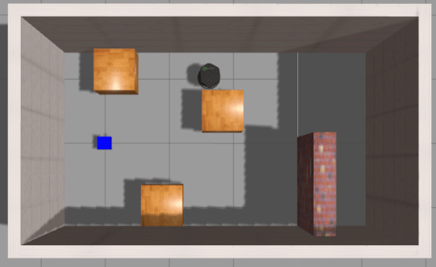
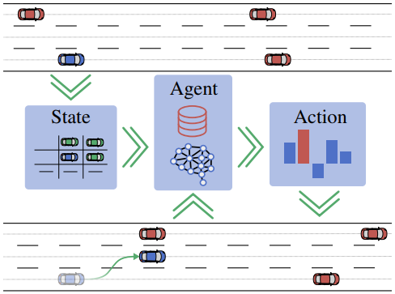
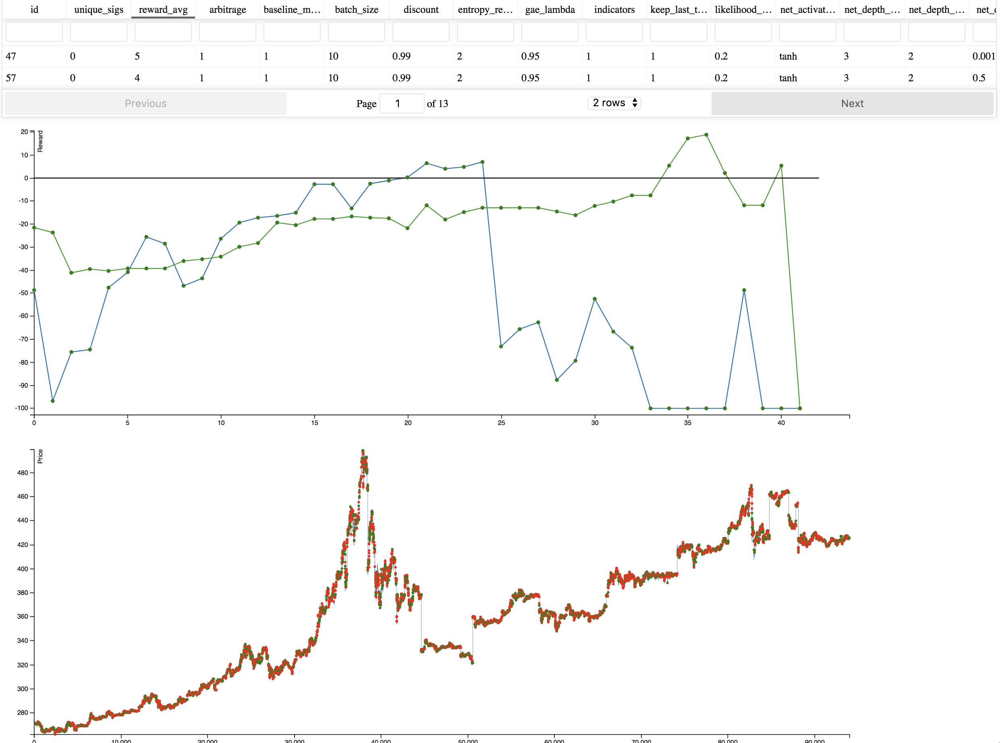

# Projects using Tensorforce

Please [get in touch](mailto:tensorforce.team@gmail.com) if you would like your project to be listed here.

### Active flow control

Tensorforce has been used within fluid mechanics to perform active flow control. Active flow control is known to be challenging due the combination of non linearity, high dimensionality, and time dependence implied by fluid mechanics, and therefore DRL is a promising new tool within this research field.

This project performs flow control of the 2D Kármán Vortex Street with Deep Reinforcement Learning. The simulations are done with FEniCS, while the Reinforcement Learning is performed with the help of the library Tensorforce. You will need Fenics, Tensorflow, Tensorforce and Gmsh available on your system in order to be able to run the code.

[Paper](https://arxiv.org/abs/1808.07664)&nbsp;&nbsp;|&nbsp;&nbsp;[GitHub Project](https://github.com/jerabaul29/Cylinder2DFlowControlDRL)

### DeepCrawl

DeepCrawl is a turn-based strategy game for mobile platforms, where all the enemies are trained with Deep Reinforcement Learning algorithms. The game is designed to be hard, yet fair: the player will have to explore the dungeons and defeat all the guardians of the rooms, paying attention to every moves the AI does!

The game was developed in Unity, while the AI was built through Tensorforce and Unity ML-Agents.

The project was part of a Master thesis in Computer Engineering at Università degli Studi di Firenze, with title *"DeepCrawl: Deep Reinforcement Learning for turn-based strategy games"*.

[GitHub Project](https://github.com/SestoAle/DeepCrawl)

### Navbot: Using RGB Image as Visual Input for Mapless Robot Navigation

A collection for mapless robot navigation using RGB image as visual input. It contains the test environment and motion planners, aiming at realizing all the three levels of mapless navigation:

1. memorizing efficiently; 
2. from memorizing to reasoning; 
3. more powerful reasoning

[GitHub Project](https://github.com/marooncn/navbot)

### Adaptive Behavior Generation for Autonomous Driving

Making the right decision in traffic is a challenging task that is highly dependent on individual preferences as well as the surrounding environment. Therefore it is hard to model solely based on expert knowledge. In this work we use Deep Reinforcement Learning to learn maneuver decisions based on a compact semantic state representation. This ensures a consistent model of the environment across scenarios as well as a behavior adaptation function, enabling on-line changes
of desired behaviors without re-training. The input for the neural network is a simulated object list similar to that of Radar or Lidar sensors, superimposed by a relational semantic scene description. The state as well as the reward are extended by a behavior adaptation function and a parameterization respectively. With little expert knowledge and a set of mid-level actions, it can be seen that the agent is capable to adhere to traffic rules and learns to drive safely in a variety of situations

[Paper](https://arxiv.org/abs/1809.03214)

### Bitcoin trading bot

This project is a Tensorforce-based Bitcoin trading bot (algo-trader). It uses deep reinforcement learning to automatically buy/sell/hold BTC based on what it learns about BTC price history. Most blogs / tutorials / boilerplate BTC trading-bots you'll find out there use supervised machine learning, likely an LTSM. That's well and good - supervised learning learns what makes a time-series tick so it can predict the next-step future. But that's where it stops. It says "the price will go up next", but it doesn't tell you what to do. Well that's simple, buy, right? Ah, buy low, sell high - it's not that simple. Thousands of lines of code go into trading rules, "if this then that" style. Reinforcement learning takes supervised to the next level - it embeds supervised within its architecture, and then decides what to do. It's beautiful stuff!

This project goes with Episode 26+ of [Machine Learning Guide](http://ocdevel.com/mlg). Those episodes are tutorial for this project; including an intro to Deep RL, hyperparameter decisions, etc.

[GitHub Project](https://github.com/lefnire/tforce_btc_trader)

